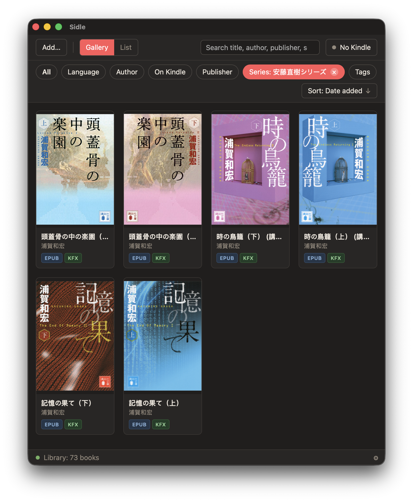
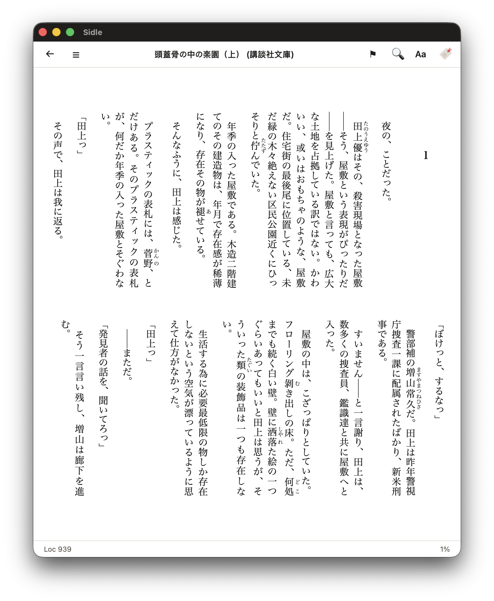

# Sidle 蛇行

<p align="center"></p>

Sideload/dump books in and out of a (jailbroken) Kindle.

## TL;DR

Sidle contains three main parts:

1. a Rust/Tauri app for managing books, converting various formats to EPUB and KFX, and reading them on macOS;
2. a native Kindle app to pull books from the library and sync annotations back to the library via WIFI;

The Tauri app doesn't require the Kindle to be jailbroken, but the Kindle app does.

There's also a bonus: a [pure rust JPEG XR encoder/decoder](./jxr/README.md) as a standalone crate.

## Screenshots

<p align="center">
  
  
  
</p>

## Build

```sh
git clone https://github.com/huangziwei/sidle && cd sidle/
./build.sh
```

The app will be built and put into `/Applications/Sidle`

Book data and library database will be stored in `~/Library/Application Support/Sidle/`, and can be changed to other locations.

To install the Kindle native app for the first time, plug in the Kindle via USB, then in the Kindle tab, open `Kindle app` and click `Install on Kindle`. 

Tested on macOS 26 with Kindle Oasis 2 (9th Gen; 5.16.2.1.1), Kindle Colorsoft (1st Gen; 5.18.0.2), and Kindle Scribe (1st Gen; 5.19.4.0.1).

## But Why?

To sideload books to Kindle, one might just use Send-to-Kindle. But I don't want to use more Amazon services. 

One can also use Calibre. I mostly use it for DeDRM. But as Amazon tightened up their DRM recently, DeDRM stopped stripping DRM from books pulled from e-ink Kindles. The only way to deDRM that still works for me today is to use [KFXArchiver](https://github.com/Satsuoni/DeDRM_tools/discussions/74#discussioncomment-17034265) on jailbroken devices, get the KFX-ZIP, then drag them back to Calibre to produce KFX, which can then be converted to EPUB or other formats. It's a cumbersome and slow process.

I want a faster, more streamlined process to manage my books:

1. mount the Kindle, and all KFX-ZIP will be auto-imported and converted to KFX and EPUB;
2. imported EPUB will be auto-converted to KFX;
3. imported AZW3 and MOBI will be auto-converted to EPUB then KFX;
4. (bonus) imported ZIP from [Aozora/青空文庫](https://www.aozora.gr.jp) will be auto-converted to EPUB then KFX;
5. while mounted, the desktop app can push a native app to the Kindle, which can be used to view the library and download the KFX from the host within the same network (after the first push, the Kindle app updates itself over WIFI);
6. annotations (highlights, notes and bookmarks) of all books sideloaded by Sidle will be synced back to Sidle Tauri when mounted, or manually synced in the Kindle app;
7. and most importantly, all format conversion should have full support for CJK text (vertical writing mode, page progression direction, etc.), which is made possible with `bokai`, a [fork of boko](./bokai/README.md).

This is basically what Sidle does for now.
