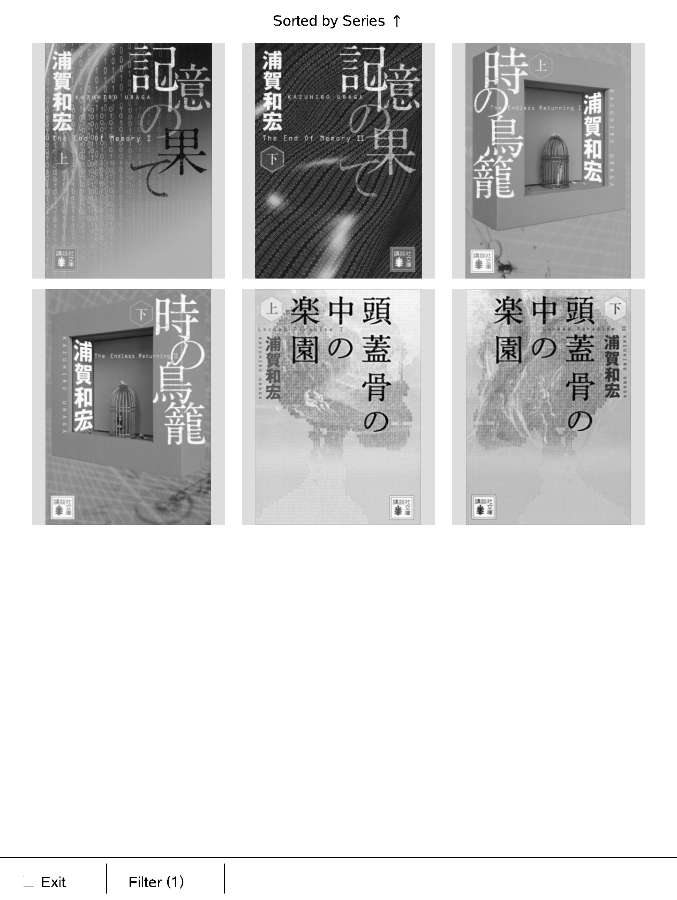

# Sidle 蛇行

<p align="center"></p>

Sideload/dump books in and out of a (jailbroken) Kindle.

## TL;DR

Sidle contains two parts:

1. a Rust/Tauri app for managing books, converting various formats to EPUB and KFX, and reading them on macOS;
2. a KUAL app to pull books from the library and sync annotations back to the library via WIFI.

The Tauri app doesn't require the Kindle to be jailbroken, but the KUAL app does (to begin with, you need to jailbreak to install KUAL itself). 

## Screenshots

<p align="center">
  
  
  
</p>

## Build

```sh
git clone https://github.com/huangziwei/sidle && cd sidle/
./build.sh
```

The app will be built and put into `/Applications/Sidle`

Book data and library database will be stored in `~/Library/Application Support/Sidle/`, and can be changed to other locations.

To install the KUAL app, plug in the Kindle via USB, then in the Kindle tab, enter `KUAL extension`, then click `push KUAL`. 

Currently only tested on macOS 26 and Kindle Oasis 2 (9th Gen) with 15.16.2.1.1.

## But Why?

To sideload books to Kindle, one might just use Send-to-Kindle. But I don't want to use more Amazon services. 

One can also use Calibre. I mostly use it for DeDRM. But as Amazon tightened up their DRM recently, DeDRM stopped stripping DRM from books pulled from e-ink Kindles. The only way to deDRM that still works for me today is to use [KFXArchiver](https://github.com/Satsuoni/DeDRM_tools/discussions/74#discussioncomment-17034265) on jailbroken devices, get the KFX-ZIP, then drag them back to Calibre to produce KFX, which can then be converted to EPUB or other formats. It's a cumbersome and slow process.

I want a faster, more streamlined process to manage my books:

1. mount the Kindle, and all KFX-ZIP will be auto-imported and converted to KFX and EPUB;
2. imported EPUB will be auto-converted to KFX;
3. imported AZW3 and MOBI will be auto-converted to EPUB then KFX;
4. (bonus) imported ZIP from [Aozora/青空文庫](https://www.aozora.gr.jp) will be auto-converted to EPUB then KFX;
5. while mounted, the desktop app can push a KUAL app to Kindle, which can be used to view the library and download the KFX from the host within the same network (after the first push, the KUAL app can now be updated over WIFI);
6. annotations (highlights, notes and bookmarks) of all books sideloaded by Sidle will be synced back to Sidle Tauri when mounted, or manually synced in the KUAL app;
7. and most importantly, all format conversion should have full support for CJK text (vertical writing mode, page progression direction, etc.), which is made possible with `boko-kai`, a [fork of boko](./boko-kai/README.md).

This is basically what Sidle does for now.

## Bonus

For format conversion only without library management, you can use this [client-side html tool](https://hzwei.dev/tools/boko.html).

## License

Sidle is licensed under the **GNU Affero General Public License v3.0 or later**
(AGPL-3.0-or-later); see [`LICENSE`](./LICENSE). This covers the Tauri desktop
app, its web frontend, the LAN server, the on-device native picker, and the
KUAL app.

Two bundled components keep their own, separate licenses:

- [`boko-kai`](./boko-kai/) — a fork of [boko](https://github.com/zacharydenton/boko); retains its upstream **GPL-3.0-or-later** ([`boko-kai/LICENSE`](./boko-kai/LICENSE)). GPLv3 §13 permits combining it with sidle's AGPLv3 code into a single conveyed work.
- [`sidle/web/foliate-kfx/`](./sidle/web/foliate-kfx/) — `paginator.js` and `overlayer.js` are vendored from [foliate-js](https://github.com/johnfactotum/foliate-js) under the **MIT** license ([`sidle/web/foliate-kfx/LICENSE`](./sidle/web/foliate-kfx/LICENSE)); the other files in that directory are sidle's own and are AGPL-licensed.